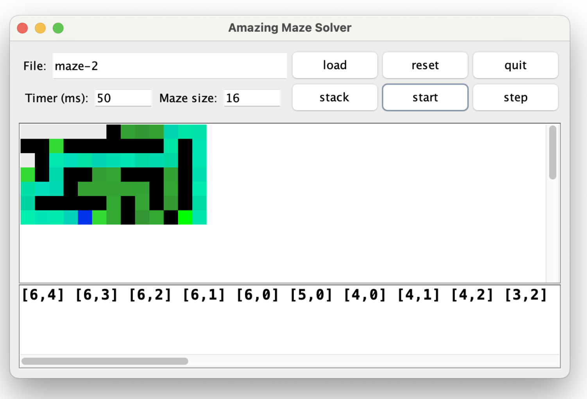

# Maze Lab

## Purpose

“In this lab you will use the power of a stack and a queue to explore and find your way through a maze. The purpose of this lab is to:


* Implement a stack and a queue.
* Build a simple linked list of nodes.
* Use your stack and queue to solve a maze.
* Explore the differences between the two solution strategies.
* Apply software team development best practices


## Requirements


* Complete each milestone as described in this lab document.
* You will work with a partner on this summative lab and demonstrate your understanding of using GitHub as a team
    * Commit to GitHub frequently, at least daily and per milestone, with a meaningful commit message
    * You and your partner must create and use branches for your development as specified in the daily milestones
    * You and your partner must issue pull requests to incorporate changes in your branch into `main`
* Edit README.md in your repository to Include a reflection
    * **togethe**r:  reflect on your implementation of the GitHub best practices for team development.
    * **individually**: reflect on your teamwork. What did you and your partner do well? What do you and your partner need to improve next time? What would you do differently next time? Your answer to each prompt must be supported by **multiple, specific examples.**
* This lab is recorded as two labs in the gradebook. One score is based on satisfying the requirements for the Maze lab. The other score is based on demonstrating GitHub best practices.


## Daily Milestones


1. **As a whole class**
    * (**Teammate A**) create `maze` branch from `main`; implement `Maze` class skeleton in `maze` branch
    * `at the "same time"`
        * (**Teammate B**) create `mazeTest` branch from `main` (not `main`); implement `Maze` unit test in `mazeTest` branch[^1]; run test (verify fails)


        * (**Teammate A**) implement `Maze` class in `maze` branch
    * (**Teammate A & B**) pull `mazeTest` branch into `maze` branch; run tests (may fail) in `maze` branch; debug `Maze` class; run tests (verify passes); pull into `main`
2. At the same time:
    * (**Teammate A**) create `stack` branch from `main`; implement `MyStack` and `MyStackTest` in `stack` branch; run tests (verify passes); pull into `main`
    * (**Teammate B**) create `queue` branch from `main`; implement `MyQueue` and `MyQueueTest`[^2] in `queue` branch; run tests (verify passes); pull into `main`


3. (**Teammate A & B**) create `solver` branch from `main`; implement `MazeSolver` in `solver` branch (**pair programming**)
4. At the same time:
    * (**Teammate A**) create `stackSolver` branch from `solver` (not `main`); implement `MazeSolverStack` in `stackSolver` branch
    * (**Teammate B**) create `queueSolver` branch from `solver` (not `main`); implement `MazeSolverQueue` in `queueSolver` branch
5. (**Teammate A & B**) tie up loose ends; pull both branches into `solver`; run tests (verify passes); uncomment all of the lines in MazeApp.java (refer to comment at the top of the file); test MazeApp by hand (verify functionality); pull into `main`

Your GitHub branching history should look similar to the following:


## Maze Lab Design and Implementation Details[^3]


### Part 1 - Representing the Maze

First let's talk about your basic maze. It has walls and pathways, and it has one (or more) starting point(s) and one (or more) exit point(s). (To keep things simple, let's just assume it has no more than one of each.) Furthermore, one wall is just like another, and any open space (not including start and finish) is also identical. So, we can think of a maze as being made up of individual squares, each square either empty, a wall, the start, or the exit.

Below is a graphical representation of the maze found in the file **maze-2**. The green box represents the start, the red box the exit, and the black squares the walls.


We represent such a maze with a text file of the following format. The first line of the file contains two integers. The first indicates the number of rows (R), the second, the number of columns (C).

The rest of the file will be R rows of C integers. The value of the integers will be as follows:

0 - an empty space

1 - a wall

2 - the start 

3 - the exit 

In terms of coordinates, consider the **upper left** corner to be position [0,0] and the lower right to be [R-1,C-1].

For example, this is the text version of the maze above (start is at [6,4] and exit at [6,11]).

7 13

0 0 0 0 0 0 1 0 0 0 0 0 0

1 1 0 1 1 1 1 1 1 1 0 1 0

0 1 0 0 0 0 0 0 0 0 0 1 0

0 1 0 1 1 0 0 1 1 1 0 1 0

0 0 0 1 0 0 0 0 0 1 0 1 0

0 1 1 1 1 1 0 1 0 1 0 1 0

0 0 0 0 2 0 0 1 0 0 1 3 0


#### The Square Class

The **Square** class represents a single square in the maze. A Square has an instance variable that represents its type (space, wall, start, or exit). Constants are defined for the four starting types of squares.

It turns out that later it will be useful if a Square knows where it is positioned in the maze. Therefore, the Square has a private instance variable of type int named **row** and **col** to represent its location within the maze.

The following methods are included in the Square class:


```
String toString
```


Return the character corresponding to this Square, using the following notations:

`_` – empty space (0)

`#` – wall (1)

`S` – Start (2)

`E` – Exit (3)

`o` – is on the solver work list

`.` – has been explored

`x` – is on the final path to the exit

The later symbols are only applied to empty spaces, not start or exit squares.


```
public int getRow()
public int getCol()
public int getType()
```


Accessor methods to get the values of the various instance variables.


```
public Square(int row, int col, int type)
```


Constructor to create a new Square object

Be aware that you will be changing this class later.


#### The Maze Class

Now we can pretty easily set up the maze itself. We will create a **Maze** class that stores the logical layout of a maze. It will contain (as an instance variable) a 2D array of **Square**s. Initially, this array will be empty and you will use a method to populate it.

As we begin working on **Maze.java**, we will also create **MazeTest.java** with JUnit test cases for the various methods.

We will include the following methods in the Maze class:


```
public Maze()
```


A constructor that takes no arguments.


```
boolean loadMaze(String filename)
```


Loads the maze that is contained in the file named **filename**. The format of the file is described above.

If we encounter a problem while reading in the file, we will return false to indicate that it failed. Returning true indicates that we have now loaded the file from disk successfully.

We will be sure to catch the exception that is raised if the user specifies an incorrect file and print out an appropriate error message when this occurs and return false. We won't just let the program crash.


```
ArrayList<Square> getNeighbors(Square sq)
```


Returns an ArrayList of the Square neighbors of the parameter Square **sq**. There will be at most four of these (to the North, East, South, and West) and we will list them in that order.

If the square is on a border, we will skip over directions that are out of bounds of the maze. We won't add `null` values.


```
Square getStart()
Square getFinish()
```


Accessor methods that return the saved start/finish locations.


```
void reset()
```


Returns the maze back to the initial state after loading. Erases any marking on squares (e.g., visited or worklist) but keeps the layout.

We will do this by invoking each Square's reset() method.


```
String toString
```


Returns a String representation of this Maze in the format given below. (This is where it's useful to have a working Square.toString method.)

For example, the maze above (i.e., **maze-2**) would be returned by toString as follows.


```
    _ _ _ _ _ _ # _ _ _ _ _ _
    # # _ # # # # # # # _ # _
    _ # _ _ _ _ _ _ _ _ _ # _
    _ # _ # # _ _ # # # _ # _
    _ _ _ # _ _ _ _ _ # _ # _
    _ # # # # # _ # _ # _ # _
    _ _ _ _ S _ _ # _ _ # E _
```


To keep things running quickly for larger mazes, we will use the StringBuilder class, which sort of works like an Arraylist, but for **Strings**. For example, instead of the following **O(n<sup>2</sup>)** code:


```
String s = "";
for( int i=0; i < data.length; i++ ) {
    s = s + data[i];
}
```


we will implement the better **O(n)** code:


```
StringBuilder sb = new StringBuilder();
for( int i=0; i < data.length; i++ ) {
    sb.append(data[i]);
}
    String s = new String(sb);
```


Before we continue, we will test that our Maze class works correctly by creating a JUnit test. Among other things, this test will load a maze from one of the supplied files, get the neighbors of a specific square, and assert that (1) there are the correct number of neighbors, and (2) the neighbors are in the correct locations. We will do this for the corners, an edge, and an interior square. There will also be a test to print out the maze, and to confirm our getStart and getFinish methods return the correct squares.

We will assume that any well-formed maze will have exactly one start and exactly one finish. We will **not** assume that all valid mazes will be entirely enclosed within walls.


### Part 2 - Stacks and Queues

We've been talking about stacks and queues in class, and now it is your time to put that theory to good use.

Write two classes **MyStack&lt;T>** and **MyQueue&lt;T>** that implement the supplied interface **Worklist**.


```
MyStack
```


An implementation of the provided **Worklist** interface that is capable of storing an arbitrarily large amount of data. Store the items in an ArrayList.


```
MyQueue
```


An implementation of the provided **Worklist** interface that is capable of storing an arbitrarily large amount of data. Use a simple (but efficient) linked-node implementation, similar to what we coded in Chapter 16.

Methods are specified in the interface file supplied in the starter code. Be sure to throw the correct exceptions.

Before continuing, add JUnit tests for **MyStack** and **MyQueue** that performs testing on your data structures. (Call these **MyStackTest** and **MyQueueTest**.) Don't forget to test the exceptions too.


### Part 3 - Solving the Maze

Now that you have a maze and working stack and queue data structures, we can use them to solve mazes! You'll next be implementing the application portion of this lab, writing the **MazeSolver** class which will bundle up the functionality of determining if a given maze has a valid solution. That is, whether you can get from the start to the finish without jumping over any walls.

Our maze solving algorithm goes something like this: begin at the start location, and trace along all possible paths to (eventually) visit every reachable square. If at some point you visit the finish Square, it was reachable. If you run out of squares to check, it isn't reachable.

Boiling this down into pseudocode, we have the following:

**At the start**


1. Create an (empty) worklist (stack/queue) of locations to explore.
2. Add the start location to it.

**Each step thereafter**


1. Is the worklist empty? If so, the exit is unreachable; terminate the algorithm.
2. Otherwise, grab the "next" location to explore from the worklist.
3. Does the location correspond to the exit square? If so, the finish was reachable; terminate the algorithm and output the path you found.
4. Otherwise, it is a reachable non-finish location that we haven't explored yet. So, explore it as follows:
    * compute all the adjacent up, right, down, left locations that are inside the maze and aren't walls, and
    * add them to the worklist for later exploration **provided they have not previously been added to the worklist.**
5. Also, record the fact that you've explored this location so you won't ever have to explore it again. Note that a location is considered "explored" once its neighbors have been put on the worklist. The neighbors themselves are not "explored" until they are removed from the worklist and checked for **their** neighbors.

Note that this pseudocode is entirely agnostic as to what kind of worklist you use (namely, a stack or a queue). You'll need to pick one when you create the worklist, but subsequently everything should work abstractly in terms of the worklist operations.


#### The MazeSolver Class

Thus, you will create a class **MazeSolver** that will implement the above algorithm, with a general worklist. The MazeSolver class should have a private instance variable of type **Maze**, a private instance variable of type **Worklist**, and should have the following methods:


```
void makeEmpty()
```


Creates an empty worklist


```
boolean isEmpty()
```


Returns true if the worklist is empty


```
void add(Square sq)
```


Adds the given Square to the worklist


```
Square next()
```


Returns the "next" item from the worklist


```
MazeSolver(Maze maze, Worklist worklist)
```


The MazeSolver constructor should take as parameters the Maze to be solved and the worklist to hold Squares, and it should perform the two initialization steps of creating an empty worklist (using the makeEmpty method) and adding the maze's start location to it (using the add method).


```
boolean isSolved()
```


A method that the application program can use to see if this algorithm has solved this maze. That is, has it determined the path to the exit or if there is no path.

This method will return true if either:


1. A path from the start to the exit has been found; OR
2. You determine there is no such path (worklist is now empty)

**String getPath()**

Returns either a string of the solution path as a list of coordinates **[i,j]** from the start to the exit or a message indicating no such path exists.

If the maze isn't solved, return a message indicating such.


```
Square step()
```


Perform one iteration of the algorithm above (i.e., steps 1 through 5) and return the Square that was just explored (and null if no such Square exists).

In order to keep track of which squares have previously been added to the worklist, you will "mark" each square that you place in the worklist. Then, before you add a square to the worklist, you should first check that it is not marked (and if it is, refrain from adding it).

Here is the suggestion for marking a Square: have each Square keep track of which Square added it to the worklist (i.e., "Which Square was being explored when this Square was added to the worklist?"). That is, add a new instance variable **Square previous** to the Square class, which will represent the Square previous to the current one; initialize this variable to null in the constructor/reset method. Then, when a Square is being added to the list for the first time, you will set the **previous** variable to point to the current Square (the Square that is being explored). If the previous variable is already non-null, then this Square has already been placed on the list, and you should not do so again.

You will also want to add in additional methods to your **Square** class to help you with this.

Also, for testing purposes, implement a main( ) method that loads a maze, creates the appropriate type of worklist, repeatedly calls the step( ) method until the maze is solved, and then prints the resulting path, if there is one.


#### Tracing the path

In order to output the solution to the maze in step 3 of the algorithm, you will need to keep track of the path that was followed in your algorithm. This seems to be a difficult proposition; however, you've already done most of the work when you marked your worklist nodes using the **previous** variable. Let us explain.

In order to keep from wandering in a circle, you should avoid exploring the same location twice. You only ever explore locations that are placed on your worklist, so you can guarantee that each location is explored at most once by making sure that each location goes on the worklist at most once. You've already accomplished this by "marking" each square that you place in the worklist.

You are marking the square by putting an arrow in it that points **back** to the square from which you added it to the worklist. Now, when you are at the exit, you can just follow the arrows back to the start.

Of course, following the arrows gives you the path in reverse order. If only you had a way to keep track of items such that the Last item In was the First item Out, then you could read all the arrows in one pass and write them back out in the correct order...


### Part 4 - Animatronics!

If everything is working in your Maze and MazeSolver classes, you should be able to uncomment all of the code in the MazeApp class and run its main method to get a GUI interface that will allow you to animate the process of finding the solution of the maze.


 





The load and quit buttons operate as you might expect. The reset button will call the Maze's reset() method and then create a new MazeSolver. If you click on the stack button it will toggle between using a Stack or Queue to solve the maze. The step button performs a single step of the MazeSolver and start will animate things taking one step per timer delay interval. Don't forget to hit `Enter` after changing values in the textboxes.

Your Maze's toString method is used to display the maze in the main window (with the string values converted to colors), and the getPath() method from MazeSolver is used for the bottom window.


## Extensions


* Try the bonus mazes in the extra-mazes folder.
* Add more awesome.


## Submission


* Submit a link to your GitHub repository with this assignment.


## Assessment

The MazeLab will be assessed according to this [rubric](https://docs.google.com/document/d/1D0RaZsK3zNBjdlC8mNX-oeJF9VyMu6XkqbbFzwmwSHg/preview). In addition, [this video](https://youtu.be/jPpymDAQwfk) demonstrates how the MazeLab will be run to determine that it appears to meet the requirements.


<!-- Footnotes themselves at the bottom. -->
## Notes

[^1]:

     There is a maze-invalid file that contains an improperly formatted maze and should be used in the test to ensure exceptions do not go unhandled.

[^2]:

     To avoid future headaches, ensure that the test thoroughly tests the Queue class. Specifically, make sure to test that the last element in the queue is successfully dequeued.

[^3]:
     slightly adapted from  Benjamin A. Kuperman's original lab
